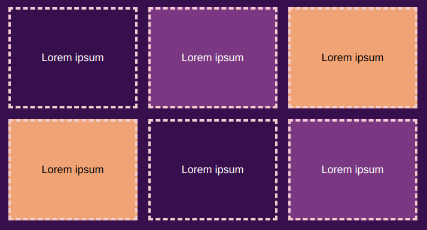

You can use the `gap` property on the `wrap` class in `style.css` to create a horizontal and/or vertical gap between wrapped items. This can be useful when you use borders or shadows. 

**Note:** The `gap` property is not supported by older web browsers. 

{:width="400px"}

--- code ---
---
language: css
filename: style.css
line_numbers: false
line_number_start: 1
line_highlights: 10
---
/* Styles just for the .wrap class */

.wrap {
  /* Make content wrap over multiple rows */
  display: flex;
  flex-wrap: wrap;
  justify-content: center;
  align-items: center;
  box-sizing: border-box;
  gap: 1rem 1rem; /* horizontal and vertical gap */
}

--- /code ---
