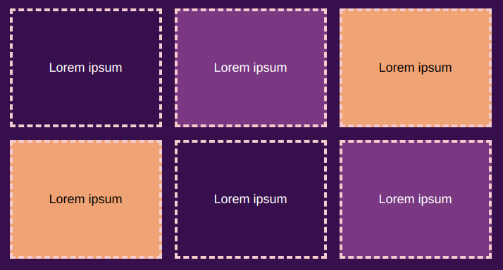

Tu peux utiliser la propriété `gap` de la classe `wrap` dans `style.css` pour créer un espace horizontal et/ou vertical entre les éléments enveloppés. Cela peut être utile lorsque tu utilises des bordures ou des ombres.

**Remarque :** la propriété `gap` n'est pas prise en charge par les anciens navigateurs web.

{:width="400px"}

## --- code ---

language: css
filename: style.css
line_numbers: false
line_number_start: 1
line_highlights: 10
--------------------------------------------------------

/\* Styles just for the .wrap class \*/

.wrap {
/\* Make content wrap over multiple rows _/
display: flex;
flex-wrap: wrap;
justify-content: center;
align-items: center;
box-sizing: border-box;
gap: 1rem 1rem; /_ horizontal and vertical gap \*/
}

\--- /code ---
